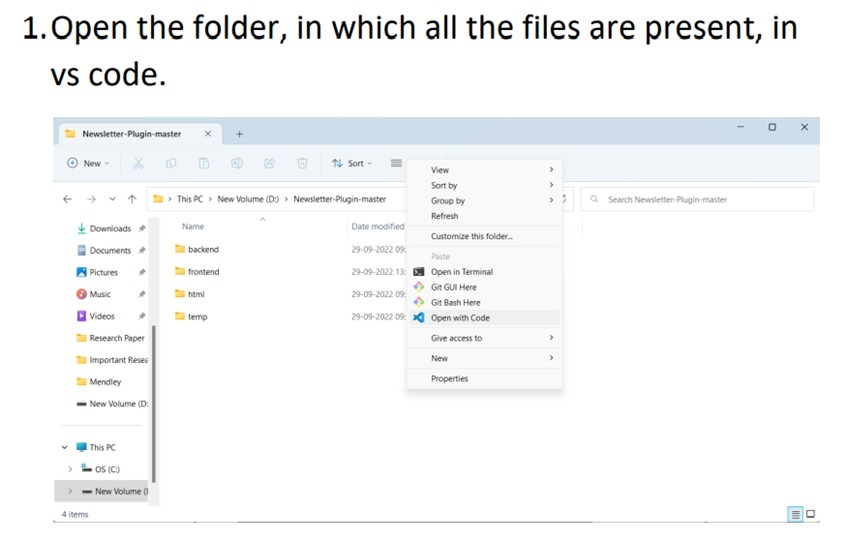

# NewsLetter Plugin

This plugin can be embedded into any website. It helps the user run thier own NewsLetter.

## 🔗 Links
[](https://www.linkedin.com/in/vijay-chaurasia/)

## Tech Stack

**Client:** React, Redux, CSS

**Server:** Node JS, Express

**Database:** Mongo DB Atlas

## Features

- Subscribers of different user remain separated.
- Newsletter can be sent with just a single click.
- Easy to use. User does not need to struggle with several components to run his Newsletter.
- Cross platform

##  Deployment
Open the project in VS code than use command below to run the frontend.
``` bash
cd frontend
npm start
```
And to run backend use
``` bash
cd backend
npm run dev
```

## Screenshots


